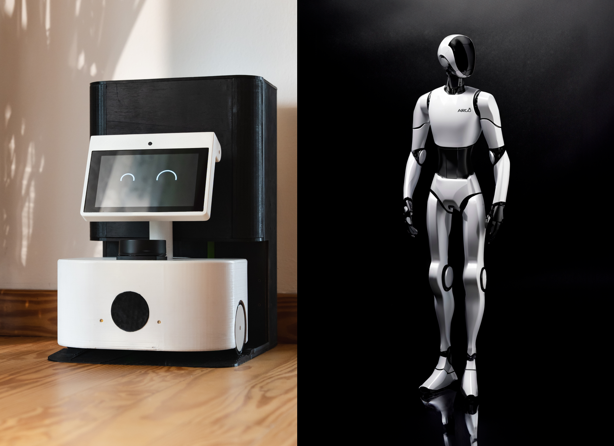

# Argo, your AI Home Robot

*Watch Argo in action on [YouTube](https://www.youtube.com/watch?v=pKa5SEiUZ1g)!*

[Argo](https:argorobot.it) is an AI home robot designed to bring autonomous navigation, conversational AI, and entertainment to everyday environments. Positioned between today’s static assistants and tomorrow’s humanoid robots, Argo paves the way for smarter home robotics!

# Open-Source: Humanoid Robotics

 

As Argo progresses, the need for advanced robotics technologies like manipulation or locomotion becomes critical. To encourage collaboration and innovation, we’ve decided to make key components of our research open-source.

Explore our repositories and deep-dive tutorials:

- [**Footsteps Planning**](https://github.com/Argo-Robot/footsteps_planning): Algorithms for planning footstep trajectories for a biped given a global path.
- [**Locomotion Policy for Quadrupeds**](https://github.com/Argo-Robot/quadrupeds_locomotion): Reinforcement learning-based policy for quadrupedal robots, enabling adaptive and smooth motion in Genesis simulator using PPO. 
- **Locomotion Policy for Bipeds**: Reinforcement learning-based policy for biped robots, enabling adaptive and smooth motion in Genesis simulator using PPO.
- [**Foundation Models for Manipulation: Overview**](https://github.com/Argo-Robot/foundation_models): Overview about state-of-art imitation learning techniques for robotic manipulation, enabling generalization across diverse tasks and environments.
- **Foundation Models for Manipulation: VLA model**: Imitation learning-based VLA model for robotic manipulation.
- [**wake-word detection**](https://github.com/Argo-Robot/wake_word_detection): wake-word detection module for conversational AI.
