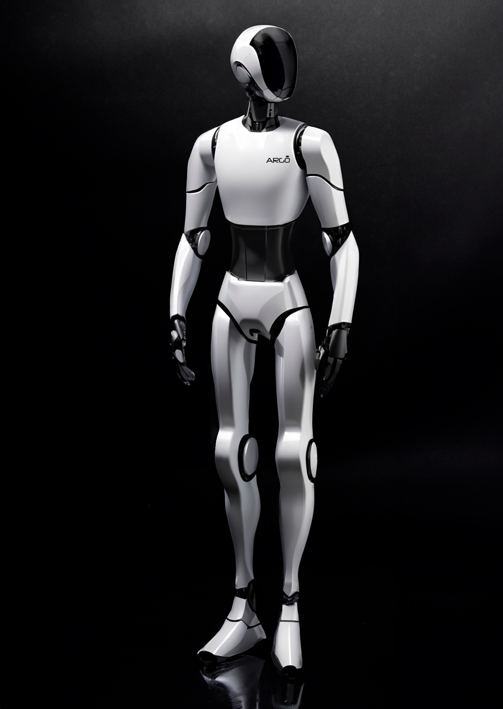

# Argo: AI Home Robot

*Watch Argo in action on [YouTube](https://www.youtube.com/watch?v=pKa5SEiUZ1g)!*

Today we have Alexa, a static box used to set timers, play music and control our smart home. In some years we will have humanoid robots doing laundry and cooking for us. Will we get up and switch from Alexa to Humanoids in one day? We don’t think so.

Argo is what there is in the middle, and it will continue to evolve!

It’s finally time to have a (really) smart robot assistant in our homes!

Argo is an home robot designed for autonomous navigation, conversational AI, entertainment, and much more. 

# Open-Source R&D: Humanoid Robotics

<Caption> 
    Original waveform of an audio signal.
</Caption>  

As Argo will evolve, more advanced robotics will be needed. We have decided to open-source it. Here you will find:

- **Footsteps Planning**:
- **Locomotion Policy for Quadrupeds**: PPO & Mujoco
- **Locomotion Policy for Bipeds**: PPO & Mujoco
- **wake-word detection**:

